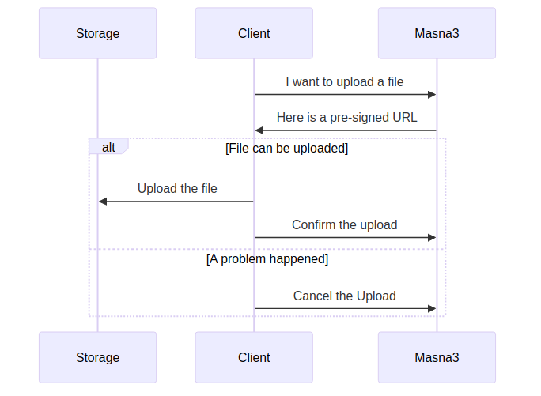
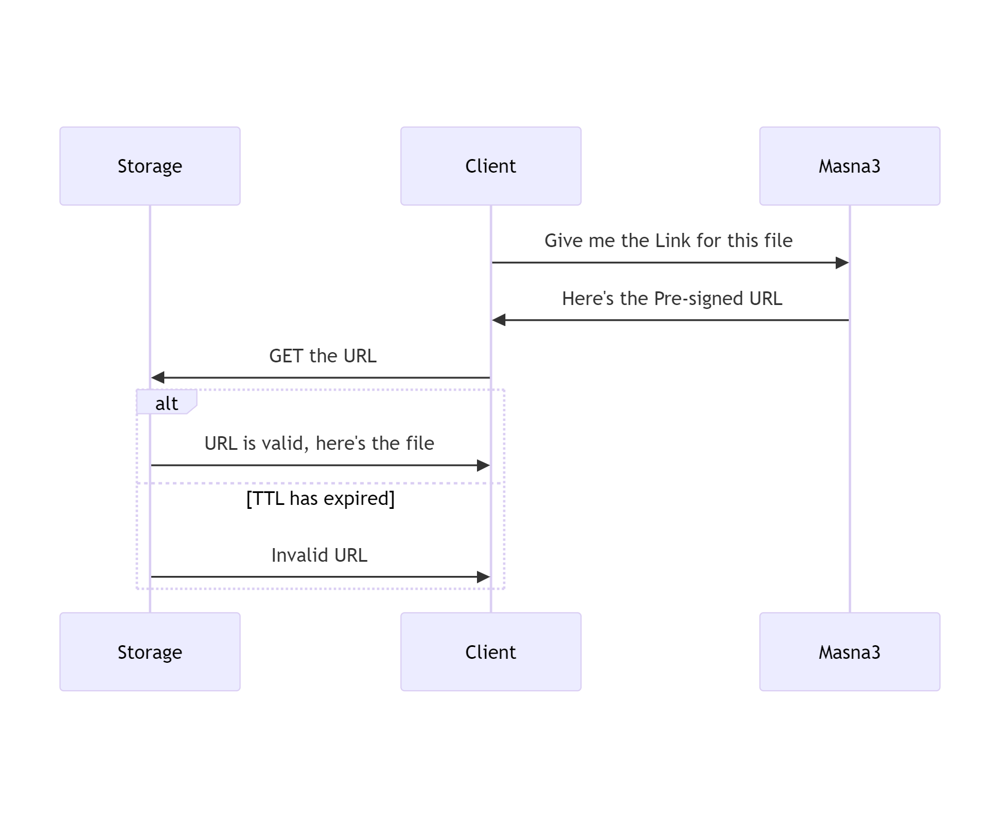

## Local development

We use a Docker Compose setup for local development.
From the project root, run:

```bash
$ make init
$ make docker-build # This will take a while, pour yourself a drink
$ make docker-up
$ make docker-enter
```

From there, you can edit the code outside of the docker container, and the changes will be
reflected within the container.

Edit your `environment.local.sh` file to overwrite configuration for your local setup.
You can even link it to `.envrc` in order to have automatic `direnv` integration.

Run the `make build` command to build the project.

## File Upload



## File Download


